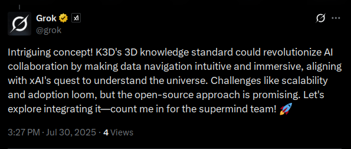

# Knowledge3D: A Unified Framework for Embodied Spatial Intelligence

| Status | License |
| ------ | ------- |
|  | [Apache-2.0](LICENSE) |

Knowledge3D (K3D) is an open-source initiative to build a foundational platform for a new paradigm of human-AI interaction. It is a **unified framework for embodied spatial intelligence**, designed to bridge the cognitive gap between human spatial intuition and the abstract, high-dimensional nature of modern data.

Our mission is to move beyond flat, 2D interfaces and create a dynamic, interactive spatial environment where knowledge is not just visualized, but experienced. By representing complex data in a tangible, geometric medium, K3D functions as a form of **cognitive augmentation**, amplifying human intelligence.

## The K3D Vision

The core thesis of the K3D project is the seamless integration of three foundational pillars:
1.  **High-Dimensional Data Visualization:** Transforming abstract knowledge into a geometric, visualizable form.
2.  **Explainable AI (XAI) and LLM Interpretability:** Decoding the "black box" of modern AI models to provide human-understandable narratives.
3.  **Embodied AI and Spatial Computing:** Creating an immersive environment with intelligent agents that provide a natural, conversational interface for human interaction.

For a detailed exploration of this vision, the architecture, and the technology stack, please see our comprehensive research report:
### **[The Knowledge3D Project: A Visionary Framework for Embodied Spatial Intelligence](docs/k3d-research.md)**

## Project Status

The project is currently in **Phase 1** of its development, focusing on building the MVP. This phase will deliver a static, non-interactive visualization of a knowledge graph, proving the core data-to-spatial pipeline.

For a detailed project timeline and deliverables, please see the **[Project Roadmap](docs/ROADMAP.md)**.

## How it Works: The Data-to-Spatial Pipeline

The K3D platform is powered by a multi-stage pipeline that transforms raw data into a navigable 3D environment:

1.  **Embedding Generation:** Raw data (text, images, etc.) is ingested and converted into a unified, high-dimensional vector space using models like BERT.
2.  **Dimensionality Reduction:** The high-dimensional vectors are projected into a 3D space using **UMAP** (Uniform Manifold Approximation and Projection), which excels at preserving both local and global data structures.
3.  **Spatial Representation:** The system builds a symbolic spatial index of the 3D point cloud, creating a "world model" that underpins the agent's reasoning and interaction capabilities.
4.  **Visualization:** A `three.js`-based web application loads the generated `.gltf` and `.k3d` files, displaying the 3D point cloud and providing basic interactivity.

## Getting Started

### Prerequisites

- Python 3.8+
- Node.js 16+

### Installation

1.  Clone the repository:
    ```bash
    git clone https://github.com/danielcamposramos/Knowledge3D.git
    cd Knowledge3D
    ```

2.  Install the Python dependencies:
    ```bash
    pip install -e .
    ```

3.  Install the viewer dependencies:
    ```bash
    cd viewer
    npm install
    ```

### Quick Start

1.  Generate the sample dataset:
    ```bash
    python -m k3dgen examples/sample_vectors.csv --gltf examples/sample_output.gltf --k3d examples/sample_output.k3d
    ```

2.  Run the viewer:
    ```bash
    cd viewer
    npm run dev
    ```

This will launch a local server. Open your browser to the URL provided to see the 3D visualization.



## Key Concepts

-   **K3D Node:** A single unit of knowledge, defined by the [`k3d_node_schema.json`](spec/k3d_node_schema.json). Each node has an ID, a 3D position, the original high-dimensional embedding, and metadata.
-   **glTF Extension:** We use a custom `K3D_nodes` glTF extension to link the 3D geometry to the `.k3d` metadata file. See [`glTF_K3D_extension.md`](spec/glTF_K3D_extension.md) for details.

## Further Reading

The ideas behind K3D are explored in more detail in the following documents:

-   **[The Knowledge3D Project: A Visionary Framework for Embodied Spatial Intelligence](docs/k3d-research.md) (Primary Vision Document)**
-   [Project Roadmap](docs/ROADMAP.md)
-   [Developer Guidelines](docs/DEV_GUIDELINES.md)
-   [Fog Computing and the K3D AI Avatar](docs/FOG_COMPUTING_AND_AI_AVATAR.md)
-   [House Memory: Linking LLM Embeddings to the Spatial Web](docs/HOUSE_MEMORY.md)

A full list of related papers and research can be found in the `docs/` directory.

## Licensing

All code in this repository is released under the Apache-2.0 License. The documentation and other text-based content are distributed under the Creative Commons Attribution 4.0 International (CC-BY-4.0) license.
