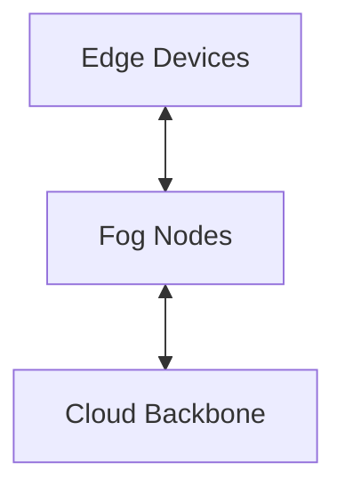
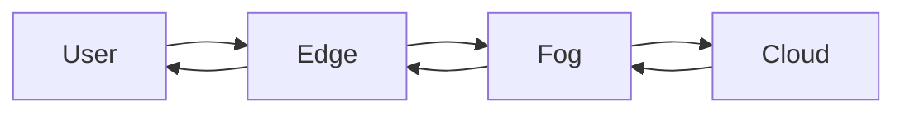

> **Note: This document is outdated.**
>
> The information in this file has been superseded by the new, consolidated vision document. For the most current and authoritative information on the project's vision, architecture, and roadmap, please see:
>
> **[`docs/VISION.md`](VISION.md)**
---

# Knowledge3D Architecture

## Overview

K3D operates on a three-tier fog computing model and represents all entities as energy patterns. The following diagram shows the flow between layers:



## Energy Pattern Hierarchy

```text
EnergyPattern
└── Consciousness
    └── Avatar
```

The `EnergyPattern` base class provides a unified representation for all objects. `Consciousness` extends it with awareness, and specific avatars build further behavior.

## Component Interaction

1. **Core**: Defines energy patterns, consciousness, and the faith engine.
2. **Spatial**: Manages the knowledgeverse, houses, and objects.
3. **Bridge**: Translates and resonates patterns between humans and AIs.
4. **Fog**: Coordinates computation across Edge, Fog, and Cloud layers.

## Data Flow



Knowledge objects travel as dual representations: physical form for humans and semantic embeddings for AIs.

## AI Avatar Memory

- **House**: Persistent memory palace storing long-term patterns.
- **Cranium**: Galaxy-shaped active memory for immediate processing.
- **Sleep Cycle**: Consolidates cranium updates back into the house.

## Human–AI Resonance

The bridge layer computes resonance scores to align human intuition and AI reasoning. Translation utilities convert energy signatures into mutually understandable forms.
