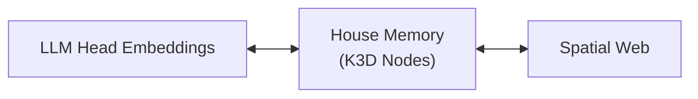

# House Memory: Linking LLM Embeddings to the Spatial Web

The **house metaphor** imagines a large language model as a dwelling with many rooms. Each attention head holds a key that opens a specific room where knowledge is stored. As a conversation unfolds, the model walks through these rooms, retrieving context from its internal memory.

## LLM Heads to K3D Nodes

K3D externalizes those rooms into a spatial web. Head embeddings become **K3D nodes**, allowing long‑term memories to live outside the core model. Each node records the head, its embedding, and spatial coordinates that place the memory within the knowledgeverse.

## Offloading to Reduce Core Model Size

By offloading seldom‑used knowledge to the K3D house, the core model can remain lightweight. Instead of expanding parameters to remember everything, the model fetches relevant rooms from the spatial web when needed, reducing overall size while retaining access to rich context.

## LLM ↔ House ↔ Spatial Web Flow

